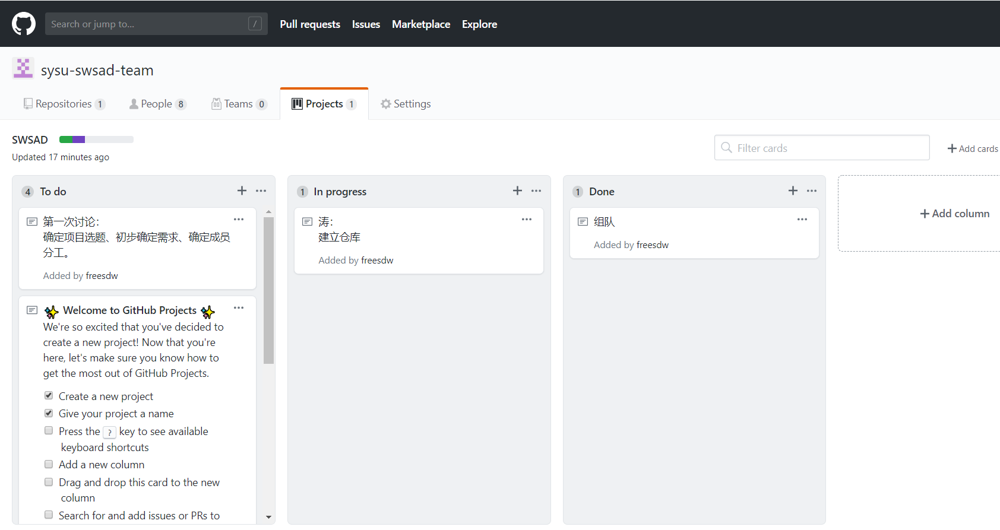
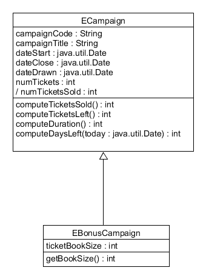

# SWSAD - Homework 2

> Software System Analysis and Design
>
> 软件项目与知识团队管理基础

## 1、简答题

- 用简短的语言给出对分析、设计的理解。

  * 分析 (analysis)：强调的是对问题和需求的调查研究，而不是解决方案。
  * 设计 (design)：强调的是满足需求的概念上的解决方案（在软件方面和硬件方面），而不是其实现。

  有益的分析和设计可以概括为：做正确的事（分析）和正确地做事（设计）。

- 用一句话描述面向对象的分析与设计的优势。

  分析师不必是“语言专家”，问题领域的专家和实现级别的专家可以使用通用符号进行交流。

- 简述 UML（统一建模语言）的作用。考试考哪些图？

  > 统一建模语言（UML）是描述、构造和文档化系统制品的可视化语言。

  UML是一种开放的方法，用于说明、可视化、构建和编写一个正在开发的、面向对象的、软件密集系统的制品的开放方法。UML展现了一系列最佳工程实践，这些最佳实践在对大规模，复杂系统进行建模方面，特别是在软件架构层次已经被验证有效。

  **考试考的UML图**，十多种视图，分4类：

  * 用例图：用户角度：功能、执行者
  * 静态图：系统静态结构
    * 类图：概念及关系
    * 对象图：某种状态或时间段内，系统中活跃的对象及其关系
    * 包图：描述系统的分解结构
  * 行为图：系统的动态行为
    * 交互图：描述对象间的消息传递
      * 顺序图：强调对象间消息发送的时序
      * 合作图：强调对象间的动态协作关系
    * 状态图：对象的动态行为。状态-事件-状态迁移-响应动作
    * 活动图：描述系统为完成某功能而执行的操作序列
  * 实现图：描述系统的组成和分布状况
    * 构件图：组成部件及其关系
    * 部署图：物理体系结构及与软件单元的对应关系

- 从软件本质的角度，解释软件范围（需求）控制的可行性

  由于软件本身的复杂性、不可见性、一致性、可变性，软件范围多数情况下对于客户和开发者都是模糊的，这形成软件产品与其他产品不同的开发过程。因此，范围管理是软件项目管理的重中之重。在多数情况下，客户与开发者能就项目的 20% 内容给出严格的需求约定，80% 的内容都是相对模糊的。因此，围绕客户目标，发现并满足客户感兴趣的内容是最关键的。

  项目范围的变更必然会造成项目进度计划、人员安排、成本等各方面的变化，处理不当则会增加项目风险，甚至造成项目陷入混乱的状态。

  范围控制就是指监控项目的范围状态，管理范围变更。范围控制的目的是在出现范围变更需求后，管理相关的计划、资源安排以及项目成果，使得项目各部分可以很好地配合在一起，避免变更带来的负面影响。 

  未经控制的产品或项目范围的扩大被称为范围蔓延。变更是不可避免的，为防止范围蔓延，在每个项目上，都必须强制实施某种形式的变更控制。

  2/8 法则在软件项目中有重要的应用。由于软件的本质，软件范围是模糊的，但是通常细化 20% 有效需求，可满足 80% 客户需要。因此，正确发现并做好这 20% 正确的事情，将会使团队在竞争中获取领先的位置。

## 2、项目管理实践

### 看板使用练习（提交看板执行结果贴图，建议使用 Git project）

- 使用截图工具（png格式输出），展现你团队的任务 Kanban
- 每个人的任务是明确的。必须一周后可以看到具体结果
- 每个人的任务是1-2项
- 至少包含一个团队活动任务

### UML绘图工具练习（提交贴图，必须使用 UMLet）

- 请在 参考书2 或 教材 中选择一个类图（给出参考书页码图号）

参考书2：Requirements Analysis and System Design, Leszek A. Maciaszek, 3rd Edition

P252, Figure 5.6

