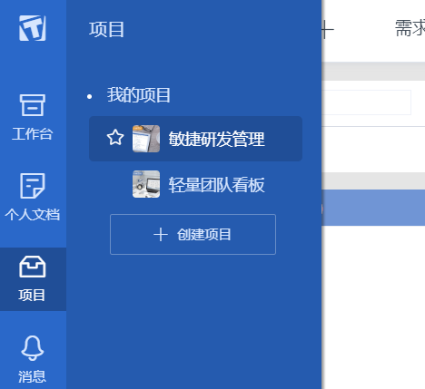
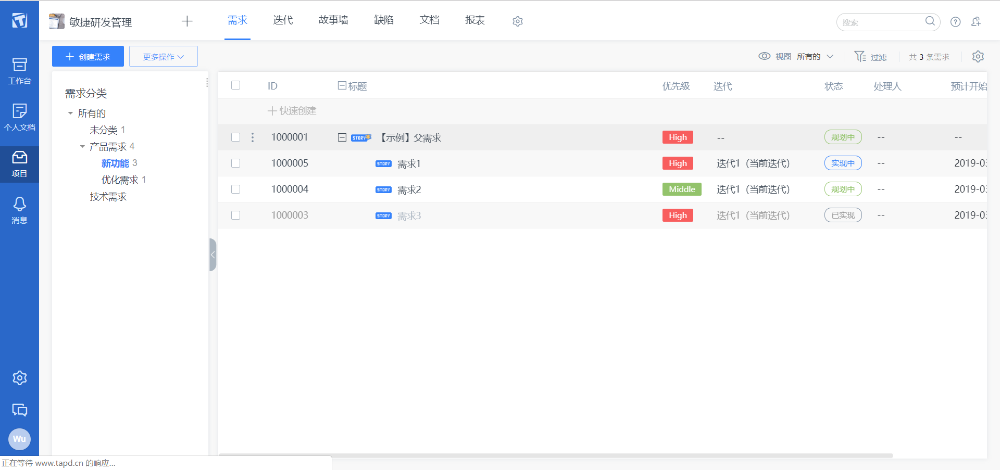
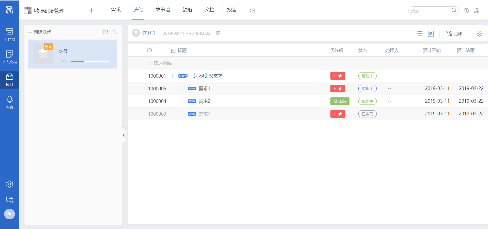
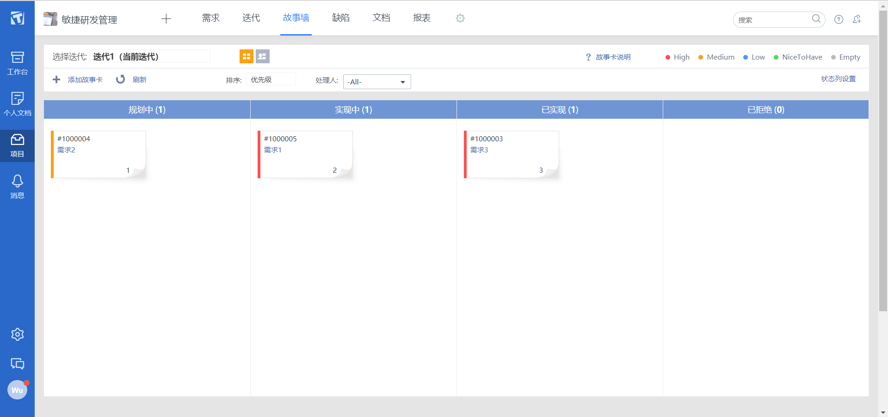
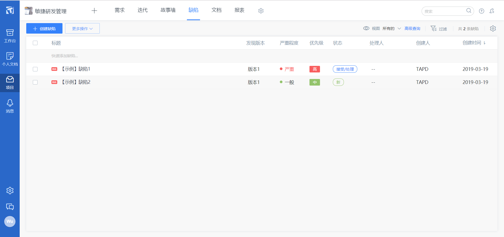
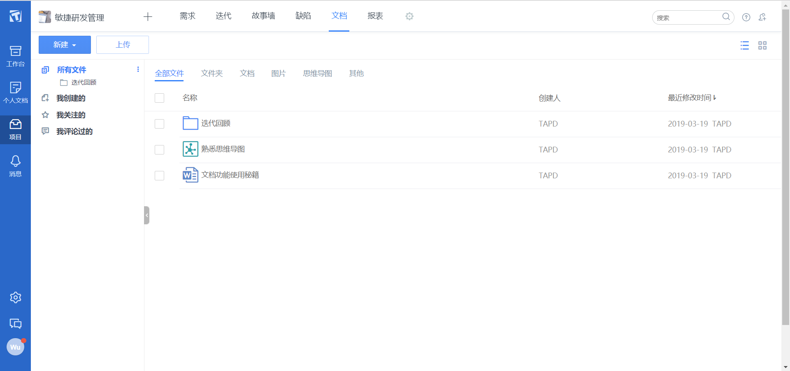
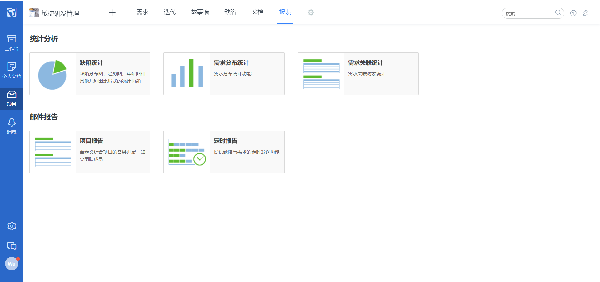

# SWSAD - Homework 3

> Software System Analysis and Design
>
> 软件项目过程模型与规划

## 1、简答题

- 简述瀑布模型、增量模型、螺旋模型（含原型方法）的优缺点

  - 从项目特点、风险特征、人力资源利用角度思考

  **瀑布模型：**

  * 优点：
    * 降低软件开发的复杂程度，提高软件开发过程的透明性，提高软件开发过程的可管理性。
    * 推迟软件实现，强调在软件实现前必须进行分析和设计工作。
    * 以项目的阶段评审和文档控制为手段有效地对整个开发过程进行指导，保证了阶段之间的正确衔接，能够及时发现并纠正开发过程中存在的缺陷，使产品达到预期的质量要求。
  * 缺点：
    * 强调过程活动的线性顺序。
    * 缺乏灵活性，尤其无法解决软件需求不明确或不准确的问题。
    * 风险控制能力较弱。
    * 瀑布模型中的软件活动是文档驱动的，当阶段之间规定过多的文档时，会极大地增加系统的工作量。
    * 管理人员如果仅仅以文档的完成情况来评估项目完成进度，往往会产生错误的结论。

  **增量模型：**

  - 优点：
    - 增强客户对系统的信心；
    - 降低系统失败风险；
    - 提高系统可靠性；
    - 提高系统的稳定性和可维护性。
  - 缺点：
    - 建立初始模型时，作为增量基础的基本业务服务的确定有一定难度；
    - 增量粒度难以选择。

  **螺旋模型（含原型方法）：**

  - 优点：
    - 通过原型的建立，使软件开发在每个迭代的最初明确方向；
    - 通过风险分析，最大程度地降低软件彻底失败造成损失的可能性；
    - 在每个迭代阶段植入软件测试，使每个阶段的质量得到保证；
    - 整体过程具备很高的灵活性，在开发过程的任何阶段自由应对变化；
    - 每个迭代阶段累计开发成本，使支出状况容易掌握；
    - 通过对用户反馈的采集，与用户沟通，以保证用户需求的最大实现。
  - 缺点：
    - 过分依赖风险分析经验与技术，一旦在风险分析过程中出现偏差将造成重大损失；
    - 过于灵活的开发过程不利于已经签署合同的客户与开发者之间的协调；
    - 由于只适用大型软件，过大的风险管理支出会影响客户的最终收益。

  

- 简述统一过程三大特点，与面向对象的方法有什么关系？

  **三大特点：**

  - 用例驱动
  - 以架构为中心
  - 受控的迭代式增量开发 

  **与面向对象的方法的关系：**

  UP 是一种基于 UML 的、以构架为中心、用例驱动与风险驱动相结合的迭代增量过程。它将软件开发过程要素和软件工件要素整合在统一的软件工程框架中，是一个面向对象的程序开发方法论。

  UP 以用例为中心，使用 UML 的模型图作为交流语言，在项目之初就建立详细的用例说明，制定详细计划，大部分活动产生丰富完备的文档。

  根据流行的统一过程指南，现代软件工程中的OOAD最好是以迭代和增量的方式进行。通过迭代，OOAD活动的输出、OOA的分析模型和OOD的设计模型将在风险和业务价值等关键因素的驱动下不断地被细化和发展。

  

- 简述统一过程四个阶段的划分准则是什么？每个阶段关键的里程碑是什么？

  UP 中的软件生命周期在时间维度上被分解为四个顺序的阶段：

  * 初始阶段 (Inception)
  * 精化阶段 (Elaboration)
  * 构建阶段 (Construction) 
  * 产品交付阶段 (Transition)

  每个阶段结束于一个主要的里程碑 (Major Milestone)，并在阶段结尾执行一次评估以确定这个阶段的目标是否已经满足。如果评估结果令人满意的话，可以允许项目进入下一个阶段。

  **初始阶段：** 生命周期目标(Lifecycle Objective) 里程碑，包括一些重要的文档，如：项目构想(Vision)、原始用例模型、原始业务风险评估、一个或者多个原型、原始业务案例等。通过对文档的评审确定用例需求理解正确、项目风险评估合理、阶段计划可行等。

  **精化阶段：** 生命周期体系结构(Lifecycle Architecture) 里程碑，包括风险分析文档、软件体系结构基线、项目计划、可执行的进化原型、初始版本的用户手册等。通过评审确定软件体系结构已经稳定、高风险的业务需求和技术机制已经解决、修订的项目计划可行等。

  **构建阶段：** 初始运行能力(Initial Operational Capability) 里程碑，包括可以运行的软件产品、用户手册等，它决定了产品是否可以在测试环境中进行部署。此刻，要确定软件、环境、用户是否可以开始系统的运行。

  **产品交付阶段：** 产品发布(Product Release) 里程碑，确定最终目标是否实现，是否应该开始产品下一个版本的另一个开发周期。在一些情况下这个里程碑可能与下一个周期的初始阶段相重合。

  

- 软件企业为什么能按固定节奏生产、固定周期发布软件产品？它给企业项目管理带来哪些好处？

  软件企业通常使用统一过程 (UP) 作为软件开发过程模型。UP 的开发过程建立在一系列迭代之上，每次迭代都有一个固定的时间限制（例如四个星期），把软件开发的生命周期分为多个循环，每个循环由四个阶段组成，每个阶段完成确定的任务，每个阶段都有一个里程碑产生，让开发团队能有比较准确的把握。四个阶段分别为初始阶段，精化阶段，构造阶段，产品交付阶段，使软件企业能按固定节奏生产、固定周期发布软件产品。

  **给企业项目管理带来的好处：** 提高了团队生产力，在迭代的开发过程、需求管理、基于组件的体系结构、可视化软件建模、验证软件质量及控制软件变更等方面，针对所有关键的开发活动为每个开发成员提供了必要的准则、模板和工具指导，并确保全体成员共享相同的知识基础。它建立了简洁和清晰的过程结构，为开发过程提供较大的通用性。

## 2、实践题

下载腾讯微信企业版PC端，安装腾讯敏捷产品研发平台（TAPD），了解使用 TAPD 的最佳实践

- 比较完善 backlog 支持（树结构）
- 迭代（sprint）安排
- 较好的缺陷管理
- Kanban
- 统计

TAPD（[https://www.tapd.cn](https://www.tapd.cn/)）是Tencent Agile Product Development的缩写，即：腾讯敏捷产品研发，凝聚腾讯多年团队协作理念和敏捷研发精髓。TAPD提供看板、在线文档、敏捷需求规划、迭代计划&跟踪、任务工时管理、缺陷跟踪管理、测试计划&用例、持续集成、持续交付&部署等丰富的可配置功能。

打开 TAPD：https://www.tapd.cn/official/select_version

注册账号，点击免费试用专业版。

查看示例项目管理：

敏捷研发解决方案包含需求、迭代、故事墙、缺陷、报表、文档等6个核心应用，还支持通过移动端管理工作。

需求：

迭代：

故事墙：

缺陷管理：

文档：

报表：

