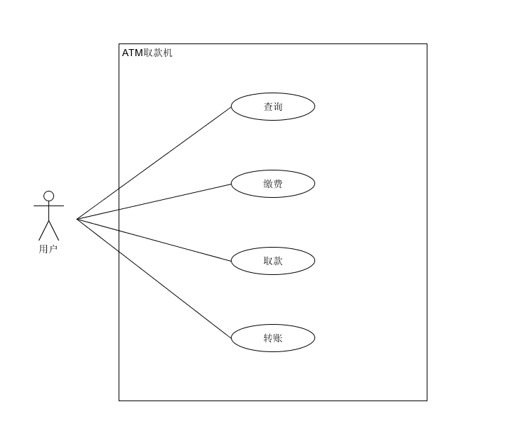
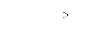
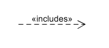
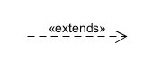
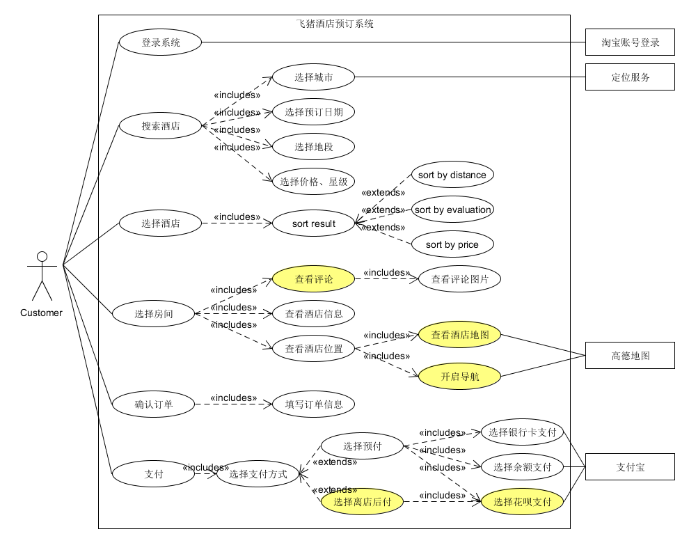
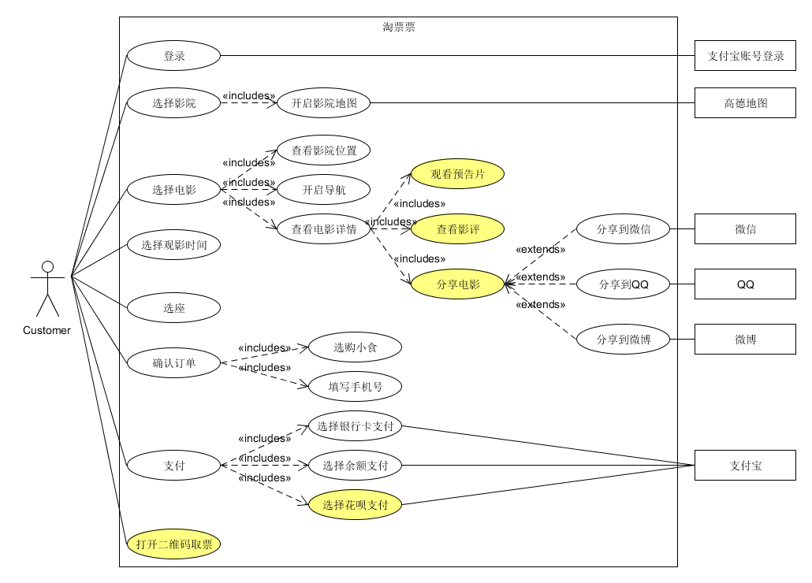

# SWSAD - Homework 6

> Software System Analysis and Design
>
> 用例建模 - 绘制用例图

## 1、简答题

1. **用例的概念**

   用例 (use case) 就是一组相关的成功和失败场景集合，用来描述参与者如何使用系统来实现其目标。注意，用例不是图形，而是文本形式的情景描述。

2. **用例和场景的关系？什么是主场景或 happy path？**

   场景 (scenario) 是参与者和系统之间的一系列特定的活动和交互，也称为用例实例 (use case instance)。用例包含了一系列场景，包括主场景 (primary scenario) ，以及零个或多个备选场景 (alternate scenario)。场景是使用系统的一个特定情节或用例的一条执行路径。例如，使用现金成功购买商品的场景，或者由于信用卡付款被拒绝造成的购买失败场景。

   主场景 (primary scenario)，也被称为 happy path，是系统主要的交互，通常是成功的场景，是最常用，直接地实现用户目标的故事。

3. **用例有哪些形式？**

   用例能够以不同形式化程度或格式进行编写：

   * 摘要 (Brief, high level)

     简洁的一段式概要，通常用于主成功场景。在早期需求分析过程中，为快速了解主题和范围，可能只需要几分钟进行编写。

   * 非正式 (Casual, 简便格式)

     非正式的段落格式。用几个段落覆盖不同场景。

   * 详述 (Fully)

     详细填写所有步骤及各种变化，同时具有补充部分，如前置条件和成功保证。

4. **对于复杂业务，为什么编制完整用例非常难？**

   完整用例是结构化的，它展示了更多细节，并且更为深入。对于复杂业务，用例的场景很多，并且很复杂，因此编制完整用例非常难。

5. **什么是用例图？**

   用例图是对系统上下文 (system context) 的一个很好的描述

   * 用例图是一种优秀的系统语境图 (context diagram)
   * 用例图能够展示系统边界、位于边界之外的事物以及系统如何被使用
   * 用例图可以作为沟通的工具，用以概括系统及其参与者的行为

6. **用例图的基本符号与元素？**

   * 参与者 (Actor)。表示与您的应用程序或系统进行交互的用户、组织或外部系统。用一个小人表示。

     

   * 用例 (Use Case)。用例就是外部可见的系统功能，对系统提供的服务进行描述。用椭圆表示。

     

   * 子系统 (Subsystem)。用来展示系统的一部分功能，这部分功能联系紧密。

     

   * 关系

     用例图中涉及的关系有：关联、泛化、包含、扩展。

     | 关系类型           | 说明                       | 表式符号               |
     | ------------------ | -------------------------- | ---------------------- |
     | 关联 (Association) | 参与者与用例之间的关系     |  |
     | 泛化 (Inheritance) | 参与者之间或用力之间的关系 |  |
     | 包含 (Include)     | 用例之间的关系             |  |
     | 扩展 (Extend)      | 用例之间的关系             |  |

7. **用例图的画法与步骤**

   * 确定系统边界。系统框放在总监，名字放在正上方。
   * 确定参与者，通过使用系统的服务实现其目标的那些人或事物。主要参与者置于左侧，支持性参与者置于右侧。
   * 确定参与者之间的关系 (泛化关系)。
   * 识别用例，确定满足每个主要参与者目标的系统服务。
   * 建立关系，用例与用例之间，用例与参与者之间的关系。
   * 确定关联的外部支持系统。放在系统框右边。

8. **用例图给利益相关人与开发者的价值有哪些？**

   对于利益相关人与开发者来说，用例图对于将要转化为设计选择和开发优先级的系统的功能需求的可视化很有价值。它们也有助于识别可能影响系统的任何内部或外部因素，并应予以考虑。它们从系统外部提供了一个良好的高级分析。用例图指定了系统如何与参与者交互，而不必担心该功能如何实现的细节。利益相关人可以直观地在用例图中看到系统的结果和功能，而用例图是开发者与设计者之间的重要交流工具。

## 2、建模练习题（用例模型）

- 选择2-3个你熟悉的类似业务的在线服务系统（或移动 APP），如定旅馆（携程、去哪儿等）、订电影票、背单词APP等，分别绘制它们用例图。并满足以下要求：
  - 请使用用户的视角，描述用户目标或系统提供的服务
  - 粒度达到子用例级别，并用 include 和 exclude 关联它们
  - 请用色彩标注出你认为创新（区别于竞争对手的）用例或子用例
  - 尽可能识别外部系统和服务

  飞猪酒店预订系统、淘票票的用例图：

- 然后，回答下列问题：
  1. 为什么相似系统的用例图是相似的？

     因为相似的系统中，用户需求总是有相似性，所以它们的用例图是相似的。

  2. 如果是定旅馆业务，请对比 Asg_RH 用例图，简述如何利用不同时代、不同地区产品的用例图，展现、突出创新业务和技术

     对比 Asg_RH 的用例图，飞猪酒店预订系统有不少创新性的并且有竞争性的业务和技术。在项目初期，通常会参考已存在的与本项目相似的产品，比如订酒店的系统在以前就有很多，了解他们的核心功能，画出其用例图，确定基本功能。再通过调查了解当今用户的对产品的要求，结合当今时代的新技术，如定位功能、导航功能、评论功能、移动支付（预付和离店付）等，添加以往相似产品没有的功能用例，实现创新业务。

  3. 如何利用用例图定位创新思路（业务创新、或技术创新、或商业模式创新）在系统中的作用

     使用用例图绘制出各种用例，然后用色彩标注出创新的用例或子用例。

  4. 请使用 SCRUM 方法，选择一个用例图，编制某定旅馆开发的需求（backlog）开发计划表

     backlog 的意思是积压未办之事。

     飞猪酒店预订系统 backlog

     | ID   | Name     | Imp  | Est  | How to demo                          | Notes                                                    |
     | ---- | -------- | ---- | ---- | ------------------------------------ | -------------------------------------------------------- |
     | 1    | 登录系统 | 7    | 3    | 淘宝账号登录                         | 关联支付宝或淘宝的账号                                   |
     | 2    | 搜索酒店 | 10   | 10   | 输入地段、日期、星级、价格，搜索酒店 | 要提供以各种方式对搜索结果进行排序，如距离、价格、评分等 |
     | 3    | 预订酒店 | 9    | 8    | 查看酒店各种信息，确认房型等         | 注意显示房间是否空闲                                     |
     | 4    | 确认订单 | 6    | 4    | 确认各种预订信息，如房型、日期等     | 提醒用户确认信息                                         |
     | 5    | 支付     | 8    | 5    | 选择多种方式支付订单                 | 关联支付宝，考虑各种支付失败的情况                       |

  5. 根据任务4，参考 [使用用例点估算软件成本](https://www.ibm.com/developerworks/cn/rational/edge/09/mar09/collaris_dekker/index.html)，给出项目用例点的估算

     | 用例     | # 事务 | # 计算 | 原因 | UC 权重 |
     | -------- | ------ | ------ | ---- | ------- |
     | 登录系统 | 2      | 2      |      | 简单    |
     | 搜索酒店 | 6      | 4      |      | 平均    |
     | 预订酒店 | 5      | 3      |      | 平均    |
     | 确认订单 | 3      | 2      |      | 简单    |
     | 支付     | 2      | 1      |      | 简单    |

     
